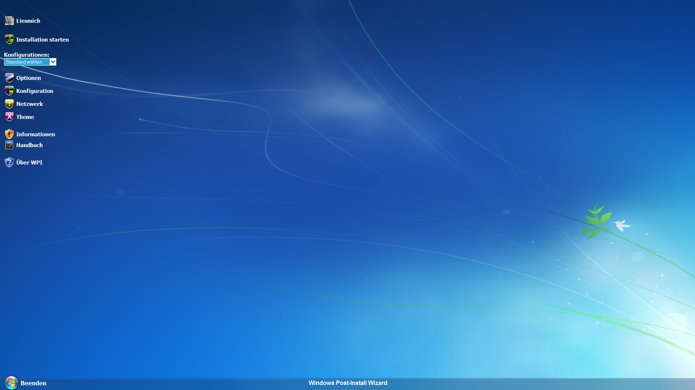
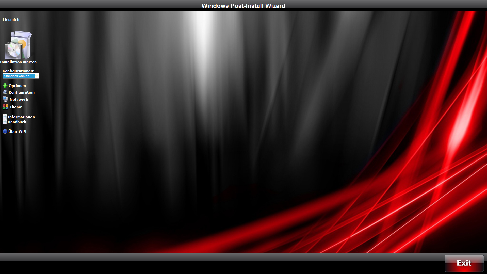
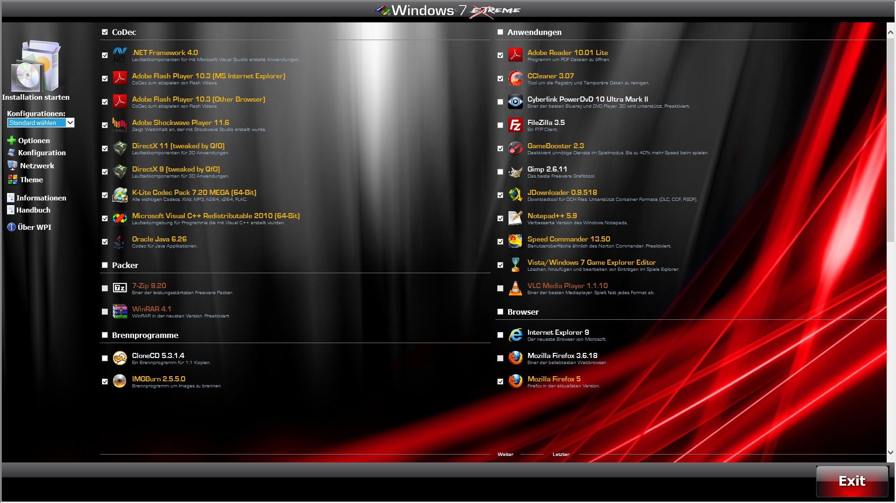
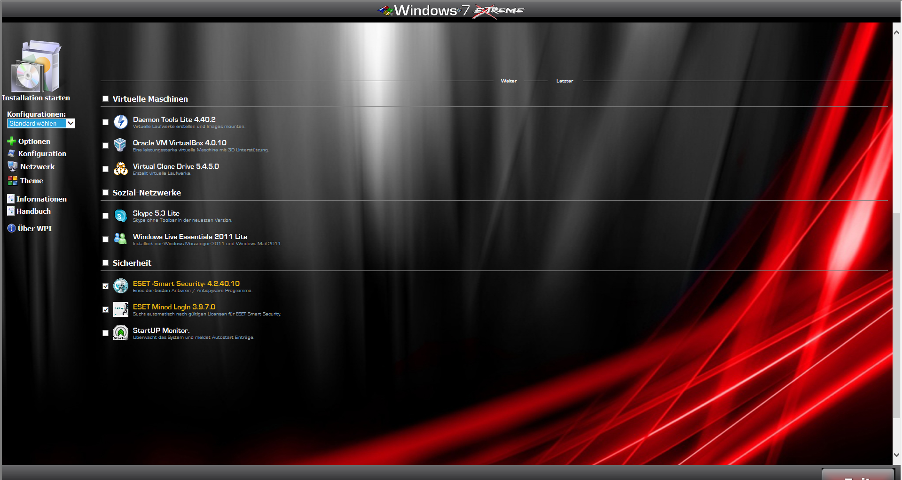
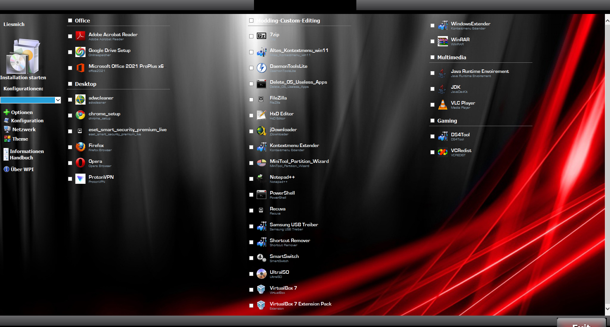

# Windows_Post_Installer
Windows Post Installer (A GUI for Software Installation)<br>

This nice Program is a Peace of the Past, and the Original Developer Website with all Extras are not longer Availible. What 4 a Shit.<br>
Here the Rest of it what i have found and some Themes and config-scripts to give you an Ideer what we can Build.<br>
WPI would work as a Extra in Windows Setup DVDs/ISOs and would started via "Scripts".<br>


# Here a Example from Github with Custom Scripts for Windows Setup Source.<br>

<a href=https://github.com/rzander/mOSD/tree/master>Custom Scripts in a Windows Setup Source</a><br>
````
git clone https://github.com/rzander/mOSD.git
````

# Here a Example from Microsoft Learn "Add a Custom Script to Windows Setup"

<a href="https://learn.microsoft.com/en-us/windows-hardware/manufacture/desktop/add-a-custom-script-to-windows-setup?view=windows-11">Add-a-Custom-Script-to-Windows-Setup</a><br>

# Here are Script Examles and Solutions how to Call something<br>

<a href=https://www.elevenforum.com/t/oem.26756/>Windows 11 Forums "$OEM$"</a><br>

The Icon Files and Themes can be only at this Time build by your Self, or a existing Theme of the Past in some Windows Setups.<br>
but there are a view Icon Files inside in PNG Format, i think you found more with google.<br>

I have add 2 Examples "UserFiles\Config.js" to Download at Releases to give you a Ideer what you can Do with it!!!
Feel Free to Download them and look the Example.

# Here a view Example Theme ScreenShots 4 Ya




# Here a view Example Build ScreenShots 4 Ya





# Here the Original Readme from Developers
````
!!! *** Existing users only *** !!! 

All others just delete the readme.txt file from the 
WPI folder to remove this notice\button.

The 5 "core" WPI files need to be moved to the new dir.

WPI will no longer recognize your files in the wpiscripts dir.

To easily do this just run the cmd file "Upgrade", In your old WPI
folder, then copy the created UserFiles folder to the new WPI folder. 

Steps to update your WPI folder:

1. Download and extract the new WPI archive to a different location.

2. Run the upgrade.cmd file in the old WPI folder.

3. Copy the newly created UserFiles folder from old to new.

4. Copy your Audio folder from old to new.

5. Copy your Install folder from old to new.

6. Copy Themes folder from old to new.

7. Copy all of your Logos\Graphics files the new location.

8. Rename or move your old folder in case something goes wrong.

9. Move the new WPI folder to where you want it.

10. Test it!

MAJOR new step!
Update your run WPI methods as WPI\WPI.hta no longer exists! 
You now need to use WPI\WPI.exe! 

(To remove the "Read Me" button delete the readme.txt file in the WPI folder.)
````

MFG
Steven
